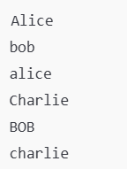
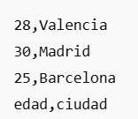

### Introducción a la ordenación.

-- El comando 'sort' en sistemas Unix y similares se utiliza para organizar las lineas de archivos de texto o flujos de entrada en un orden especifico, su principal función es realizar operaciónes de ordenación, 'sort' se
puede aplicar a varios tipos de datos, incluidos númericos y textuales.

### Sintaxis básica de SORT.

Ordenación preterminada:

    sort names.txt

    -- Realiza una clasificación organizando las lineas alfabéticamente para los archivos de texto.

    
    sort names.txt > sorted_names.txt

    -- Crea el archivo 'sorted_names.txt' con las lineas de 'names.txt' ordenadas alfabéticamente.

Ordenación númerica:

    sort -n numbers.txt

    -n : Habilita la ordenación númerica en arden ascendente, conciderando los valores como números en 
    lugar de cadenas.

    sort -nr numbers.txt

    -nr : Ordena los números en orden descendente.

    sort -n numbers.txt > sorted_numbers.txt

    -- Crea un archivo llamado 'sorted_numbers' con los números ordenados númericamente.

Ordenación inversa:

    sort -r data.txt

    -r : Invierte el orden de clasificación.

    sort data.txt > sorted_data.txt

    -- Crea un archivo 'sorted_data.txt' con las lineas de 'data.txt' ordenadas en orden descendiente.

Ordenación basada en campos:

    sort -t':' -k2,2 file.csv

    -- Este comando ordena un archivo CSV según el segundo campo.

    -t':' : Le indica a sort que el delimitador entre campos es el carácter ':'.

    -k2,2 : Le indica a sort que debe ordenar el archivo usando solo la segunda columna(campo), 
    significa 'ordenar por el campo 2 y solo el campo 2'.

    file.csv : Es el archivo que quieres ordenar.

-- Si tienes un archivo 'file.csv' con el siguiente contenido:

-- El comando: 

    sort -t':' -k2,2 file.csv

-- Ordena las lineas según la segunda columna(edad), la salida es:

-- Para ordenar en orden descendente, se agrega '-r'

    sort -t':' -k2,2 -r file.csv

Ordenación única:

    sort -u names.txt

    -u : Elimina lineas duplicadas durante la ordenación.

-- Si tienes un archivo 'names.txt' con el siguiente contenido:

-- El comando:

    sprt -u names.txt

-- Ordena las lineas alfabéticamente y elimina las duplicadas, la salida seria:

-- Para guardar el resutlado en un nuevo archivo.

    sort -u names.txt > unique_names.txt

    -- Crea el archivo 'unique_names.txt' con las lineas ordenadas y sin duplicados.

Ordenación legible por humanos:

    sort -h sizes.txt

    -h : Realiza una clasificación legible para humanos, ej: 1k(kilobytes), 2m(megabytes).

-- Si tienes un archivo 'sizes.txt', con el siguiente contenido:

-- El comando:

    sort -h sizes.txt

-- Ordena los tamaños de manor a mayor, teniendo en cuenta las unidades, y el resutlado seria algo como:

-- Para guardar el resultado en u narchivo nuevo:

    sort -h sizes.txt > sorted_sizes.txt

Delimitador personalizado:

    sort -t'|' data.txt

    -t'|' : especifica un delimitador personalizado para los campos, ordena un archivo con '|' como 
    delimitador de campo, es decir, especifica el delimitador que se usara para separar las columnas.

-- Si tienes u narchivo 'data.txt' con el siguiente contenido, donde las columnas estan separadas por '|':

-- El comando:

    sort -t'|' data.txt

-- Ordena el archivo alfabéticamente por la priemra columna(en este caso, por los nombres), la salida seria:

-- Con la opción '-k', indica que columna utilizar para ordenar.

    sort -t'|' -k2,2 data.txt

-- Ordena el archivo 'data.txt' por la segunda columna(edad) en orden ascendente.

-- Para ordenar el resultado en orden descendente se agrega la opción '-r':

    sort -t'|' -k2,2 -r data.txt

-- Se ordenan los datos por la segunda columna en orden descendente.

### Introducción a UNIQ.

uniq: Utilidad de linea de comandos de Unix y sistemas operativos similares, diseñada para 
identificar y eliminar lineas duplicadas en un archivo de texto ordenado o en un flujo de entrada.

### Sintasis básica.

    uniq [opciones] [archivo_de_entrada [archivo_de_salida]]

    opciones : Bandera para personalizar el comportamiento de uniq.

    archivo_de_entrada : Archivo que procesara uniq, si no se especifica, la entrada se toma de 
    al entrada estándar.

    archivo_de_salida : Archivo donde se escriben las lineas únicas, si no se especifica, 
    la salida se dirige a la salida estándar.

    
-- Ejemplo: 

-- archivo_entrada.txt : Archivo de entrada que contiene las lineas duplicadas. 
-- archivo_salida.txt : Archivo de salida donde se guardarán las lineas sin duplicados.

Eliminar duplicados adyacentes:

    sort data.txt | uniq

    sort data.txt : Ordena el contenido del archivo 'data.txt' en orden alfabético, o númerico.

    uniq : Elimina las lineas duplicadas consecutivas del flujo de entrada, para que 'UNIQ' funcione 
    correctamente, las lineas duplicadas deben estar contiguas, por eso se usa 'SORT', para ordenar 
    las lineas.

Supongamos que el archivo 'data.txt' contiene:

-- Con el comando:

    sort data.txt | uniq

-- El resultado seria:

-- 'SORT' ordena las lineas de 'data.txt'.

Contar lineas duplicadas:

    sort log.txt | uniq -c

    -c : Proporciona un recuento del númerode ocurrencias de cada linea.

-- Supongamos que el archivo 'log.txt' contiene:

-- Con el comando:

    sort log.txt | uniq -c

-- El resultado seria:

-- 'SORT' ordena alfabéticamente, lo que hace ordenar el contenido del archivo:

-- uniq -c : Cuenta cuantas veces aparece cada linea única, la salida muestra el número de veces que 
aparece cada linea antes de mostrar la linea en si.

Ignorar mayúsculas y minúsculas:

    sort names.txt | uniq -i

    -i : Hace que 'UNIQ' no distinga entre mayúsculas y minúsculas.

-- Supongamos que el archivo 'names.txt' contiene:

-- Con el comando:

    sort names.txt | uniq -i

-- La salida seria:

-- Primero 'SORT' ordena alfabéticamente, luego 'uniq -i' elimina las lineas duplicadas, pero 
al ignorar las diferencias entre mayúsculas y minúsculas, 'Alice', 'alice', 'BoB', 'bob', se concideran 
iguales, por lo que solo aparece una vez cada nombre en la salida.

Mostrar duplicados:

    sort file.txt | uniq -d

    -d : Muestra sólo lineas duplicadas.

-- Supongamos que el archivo 'file.txt' contiene:

-- Con el comando:

    sort file.txt | uniq -d

-- El resultado seria:

-- Primero 'SORT' ordena alfabéticamente, luego 'uniq -d' muestra las lineas que tienen 
duplicados cosnecutivos.

### Introducción a CUT.

-- Se utiliza para extraer secciones de cada linea de los archivos de texto de entrada.

### Sintaxis básica.

    cut [opciones] [archivo]

    [opciones] : Personaliza el comportamiento de 'CUT'.

    [archivo] : Archivo del que se extraerán las secciones, si no se especifica la entrada, se toma de 
    la entrada estándar.

-- Supongamos que un archivo 'datos.txt' contiene:

-- Para extraer solo los nombres(la primera columna), se puede usar el siguiente comando:

    cut -d ',' -f 1 datos.txt

    -d ',' : Indica que el delimitador es la coma ',', que separa los campos.

    -f 1 : Especifica que quieres la primera columna(nombres).

    datos.txt : Archivo de entrada.

-- El resultado es:

Especificación de delimitador:

    cut -d ',' -f2,4 csv_data.txt

-- Supongamos que el archivo 'csv_data.txt' contiene:

-- Con el comando:

    cut -d ',' -f2,4 csv_data.txt

    -d ',' : Especifica que el delimitador de los campos es al coma ','

    -f2,4 : Indica que quieres obtener la segunda y cuarta columna de cada linea.

    csv_data.txt : Archivo de entrada.

-- El resultado seria: 

Posición del personaje:

    cut -c1-5 text.txt

    -- En lugar de especificar campos, también puede extraer caracteres según la posición del carácter.

-- Supongamos que el archivo 'text.txt' contiene:

-- Con el comando:

    cut -c1-5 text.txt

    -c1-5 : Indica que quieres cortar y mostrar los caracteres desde el primero hasta el quinto de
    cada linea.

    text.txt : Archivo de entrada.

-- El resultado seria:

### Combinación SORT, UNIQ, CUT.

Comando Ordenar, eliminar duplicados y extraer campos:

    cat sample_data.csv | sort | uniq | cut -d ',' -f2,3

    cat sample_data.csv : Imprime el contenido del archivo 'sample_data.csv' 

    sort : Toma la salida de 'CAT' y ordena las lineas alfabéticamente, dado que no se especifica
    que columna ordenar, se ordena por la primera columna(en este caso 'nombre').

    uniq : Elimina las lineas duplicadas consecutivas, despues de 'SORT' las lineas duplicadas estarán
    juntas, por lo que 'UNIQ' elimina las repeticiones consecutivas.

    cut -d ',' -f2,3 : Se utiliza para seleccionar columnas especificas.

    -d ',' : Le dice a 'CUT' que el delimitador es alcoma ',' .

    -f2,3 : Le indica que queremos la columna 2 y 3 ('edad' y 'ciudad').

-- Supongamos que el archivo 'sample_data.csv' contiene:

-- Con el comando:

    cat sample_data.csv | sort | uniq | cut -d ',' -f2,3

-- El resudlato seria:

Contar entradas unicas:

    cut -d ',' -f2 data.csv | sort | uniq -c

-- Supongamos que el archivo 'data.csv' contiene:

    cut : Se usa para extraer campos especificos de un archivo.

    -d ',' : Especifica que el delimitador es una coma (',') que es comun en los archivos 'CSV'.

    -f2 : Indica que queremos obtener solo el segundo campo(en este caso, la 'edad' de cada persona), de cada 
    linea en el archivo.

    sort : Toma la salida de 'CUT' y ordena los valores.

    uniq -c : Elimina lineas duplicadas, pero con la opción '-c' ademas de eliminar los duplicados 
    contará cuántas veces aparece cada valor.

-- Con el comando:

    cut -d ',' -f2 data.csv | sort | uniq -c

-- El resultado seria:

-- significa que:

    el valor 25 aparece 2 veces.

    el valor 28 aparece 2 veces.

    el valor 30 aparece 2 veces.

Extraer las N primeras entradas:

    cut -d',' -f3 data.csv | sort | uniq -c | sort -nr | head -n 5

-- Supongamos que el archivo 'data.csv' contiene:

-- Con el comando:

    cut -d',' -f3 data.csv | sort | uniq -c | sort -nr | head -n 5

    cut : Se usa para extraer columnas específicas de un archivo.

    -d ',' : Especifica que el delimitador es una coma (',') ya que el archivo es un 'CSV'.

    -f3 : Indica que queremos extraer la tercera columna, en este caso es 'ciudad'.

    sort : Ordena alfabéticamente.

    uniq -c : Elimina lineas duplicadas consecutivas, y con '-c' cuenta cuántas veces aparece 
    cada ciudad.

    sort -nr : Vuelve a ordenar la salida, pero con forma numérica '-n' y en orden descendente '-r'.

    head -n 5 : Toma las primeras 5 lineas de la salida, en este caso al haber solo 3 ciudad, 
    simplemente muestra esas 3 ciudades.

-- El resultado seria:

### Creación y ejecución de scripts bash.

Los scripts bash son archivos de texto que contienen una serie de comandos Bash, que se ejecutan en 
secuencia cuando se ejecuta el script.

-- Para crear un script Bash simple, puedes usar un editor de texto como 'nano', 'vim' o incluso 
un editor gráfico como 'sublime'.

-- Creacion de script:

 
    nano : Abre el editor de texto que se usara en la terminal, es decir, 'NANO'.

    saludo.sh : Nombre del archivo que deseas editar o crear.

    .sh : Indica que es un archivo script de shell(no es una obligación usar esta extensión, es una 
    convención.)

-- Escribe el siguiente codigo:

    #!/bin/bash : Es una linea especial que indica que intérprete debe usarse apra ejecutar el script, 
    en este caso, le dice al sistema que use 'Bash' (el shell de comandos), para ejecutar el script.
    Es una linea shebang, que es una linea especial que se coloca al principio de un archivo de texto 
    en sistemas tipo 'Unix' (Linux o macOS), para indicar que intérprete debe usar el sistema para 
    ejecutar el archivo.

    echo "¡Hola! ¿Cómo te llamas?" : El comando 'echo' se usa para mostrar en la terminal, en este caso, 
    imprime el texto '¡Hola! ¿Cómo te llamas?', para que el usuario vea el mensaje en pantalla.

    read nombre : El comando 'READ' se usa para leer la entrada del usuario desde la terminal, en este caso, 
    se está guardando lo que el usuario escriba en al variable 'nombre', la variable 'nombre' almacenará 
    el nombre que el usuario ingrese.

    echo "¡Hola, $nombre! Bienvenido/a al mundo de Bash." : El '$nombre' dentro de las comillas es una forma 
    de expansión de variable en 'BASH', significa que el valor almacenado en al variable 'nombre'(que es 
    lo que el usuario haya ingresado), se insertará dentro del mensaje.
    EJ: Si el usuario ingresa 'Ema', la salida seria: "¡Hola, Juan! Bienvenido/a al mundo de Bash."

-- Guarda el archivo presionando 'CTRL + O', luego presiona 'ENTER' para confirmar el nombre del archivo.

-- Sal del editor con 'CTRL + X'

-- Ahora, apra darle permisos de ejecución al script, se ejecuta en la terminal: 

    chmod +x saludo.sh

-- Por ultimo se ejecuta el script: 

    ./saludo.sh

    ./ : El prefijo './' indica que el archivo que quieres ejecutar está en el directorio actual, 
    el sistema no busca por defecto en el directorio actual cuando ejecutas un comando, por eso 
    es necesario poner './' antes del nombre del archivo para especificar que debe buscar el archivo 
    en el directorio en el que estas trabajando.

    saludo.sh : Es el nombre del archivo que quieres ejecutar, es el script que contiene las 
    instrucciones en 'BASH'.

### Variables y entrada.

Las variables son escenciales para almacenar y manipular datos dentro de lso scripts, y aceptar la entrada 
del usuario permite que los scripts sean interactivos.

    #!/bin/bash
    echo "What is your name?"
    read name

    echo "Hello, $name nice to meet you."

    -- Se utiliza el comando 'READ' para capturar el nombre del usuario, que luego se muestra en un mensaje 
    de saludo.

Interpolación de variables:

    -- Implica insertar el valor de una variable dentro de una cadena, esto se hace colocando el nombre 
    de la variable entre comillas dobles y su valor se sustituye cuando se evalúa la cadena.

    #!/bin/bash
    name="alex"
    greeting="Hello, $name How are you?."
    echo $greeting

    -- Aqui, el valor de la variable de nombre se interpola en la cadena de saludo, produciendo un 
    mensaje personalizado.

### Estructura de control.

permiten que tus scripts realicen diferentes acciones según condicionales, y las repitan varias 
veces.

-- Sentencias condicionales(if, else):

    read -p "How old are you? " age

    if [ $age -ge 18 ]; then
        echo "You are an adult."

    else
        echo "You are a minor."
    fi

    read -p "How old are you? " age : Pide al usuario que ingrese su edad, '-p' permite mostrar un 
    mensaje antes de la entrada del usuario, el valor que ingresa el usuario se almacena en la 
    variable 'age'.

    if [ $age -ge 18 ]; then : Es un condicional que evalúa si el valor de la variable 'age' es mayor o 
    igual a 18, el operador '-ge' es una comparación numérica que significa 'mayor o igual que'.

    Importante: En 'BASH', cuando se utilizan corchetes( [ ] ) para las condicionales, es necesario dejar 
    un espacio después de los corchetes y antes de las variables y los operadores, sino generaria un error.

    echo "You are an adult." : Si se cumple la condición el programa imprimira el mensaje "You are an adult.", 
    en la terminal.

    else : Si la condición no se cumple, el flujo del programa pasará a la aprte del 'else'.

    echo "You are a minor." : Si el usuario es menor de 18 años, el programa imprimirá el mensaje "You 
    are a minor."    

    fi : Esta linea cierra la estructura condicional 'if' que se abrió al principio.

-- Bucles(for, while):

    Los bucles se utilizan para ejecutar un conjunto de comandos repetidamente.

    
    
-- for : Iteran sobre una lista de elementos.

    fruits=("banana", "apple", "pineapple", "durian")

    for fruit in "${fruits[@]}"; do
        echo "I like $fruit"
    done

    fruits=("banana", "apple", "pineapple", "durian") : Define una lista(array) llamada 'fruits', 
    con los nombres de varias frutas.

    for fruit in "${fruits[@]}"; do : Recorre cada elemento en el array 'fruits', la variable 'fruit' 
    toma el valor de cada fruta en cada iteración.
    El '@' tiene un propósito especifico, "${fruits[@]}" significa que estas accediendo a todos los 
    elementos del array, como argumentos separados, cada elemento del array se maneja como un argumento independiente.

    echo "I like $fruit" : Imprime un mensaje que dice "I like [fruta]", para cada fruta en el array.

-- La salida seria: 

-- while : Continúan la ejecución mientras uan condición especificada sea verdadera:

    count=1

    while [ $count -le 5 ]; do
        echo "Count= $count"
        ((count++))
    done

    count=1 : Aqui se inicializa la variable 'count' con el valor 1.

    while [ $count -le 5 ]; do : Se ejecuta mientras la condición dentro de los corchetes sea verdad, 
    aqui [ $count -le 5 ] significa 'Mientras count sea menor o igual a 5'.

    echo "Count= $count" : Esta linea imprime el valor actual de la variable 'count', el texto impreso 
    será algo como "Count= 1, Count=2" y asi sucesivamente.

    ((count++)) : Es una forma de incrementar la variable 'count' en 1 en cada iteración del bucle, 
    es una opración aritmética que aumenta el valor de 'count' por 1.
    Se hace después de imprimir el valor de 'count', asegurando que la siguiente iteración tenga el valor 
    actualizado de 'count'.

    done : Indica el final del bloque del bucle 'while', despues de ejecutar el código dentro del bucle, 
    se vuelve a verificar la condición, si es verdadera el bucle continuará, sino, el bucle se detendrá.

-- La salida seria: 

### Funciones.

    
Permite crear fragmentos de código modulares y reutilizables, ayudan a organizar el script, prommueven la reutilización del codigo y facilita su mantenimiento.

-- Creación y uso de funciónes.

    -- En bash son bloques de código que realizan una tarea especifica, se definen mediante la palabra 
    clave 'function', o simplemente con el nombre de la función seguido de paréntesis.
    Se puede llamar a una función para ejecutar su código, lo que hace que el script sea mas modular y fácil de entender.

    greet() {
        echo "Hello, welcome to the script!"
    }

    greet

    greet() : El nombre elegido para la función.

    {} : Todo lo que esta dentro de "{}" es el cuerpo de la función

    echo "Hello, welcome to the script!" : Se ejecuta dentro de la función, lo que imprime el texto "Hello, welcome to the script!" en la consola cuando se llama a la función.

    greet : Aqui se llama a la función 'greet', al ser llamada, imprime el mensaje "Hello, welcome to the script!" en la consola.

Otro ejemplo seria:

    add() {
        local result=$(($1 + $2))
        echo $result
    }

    sum=$(add 5 3)
    echo "The sum is: $sum"

    add() : El nombre elegido para la función.

    local result=$(($1 + $2)) : La función toma 2 parametros, '$1 y $2', que son el primer y segundo argumento, el resultado se almacena en la variable local 'result'.

    local : Se utiliza para declarar 'result' como variable local, lo que significa que solo estará 
    disponible dentro de la función.

    echo $result : Después de calcular la suma, la función imprime el valor de 'result'.

    
    sum=$(add 5 1) : Aqui se llama a la función 'add', ásando lso argumentos '5 y 3'.

    -- El resultado de la fucnión(la suma de 5 y 3) se asigna a la variable 'sum' usando '$()'(La 
    sustitución de comandos), esto significa que el valor retornado por 'add'(el valor de 'result'), se almacena en 'sum'.

    echo "The sum is: $sum" : Finalmente se imprime el resultado almacenado en 'sum', que es 8.

-- La salida seria: 

    

### Conceptos de funciónes avanzadas.