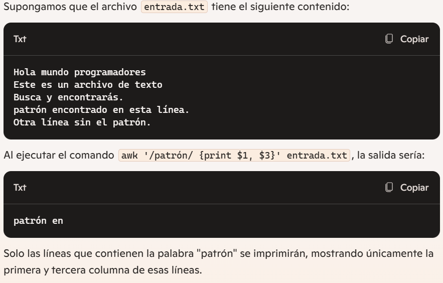

### Comandos Bash.

### Comandos básicos del sistema de archivos (ls, cd, pwd).

ls: Poporciona una reprecentación visual de lo que hay en la carpeta.

ls -l: Lista archivos y directorios, en el directorioa actual, en un formato mas largo.
Puede incluir: permisos, números de enlaces, propietario, grupo, tamaño, fecha y hora de la ultima modificacion y nombre.

-- si ejecutas: -rw-r--r-- 1 usuario grupo  4096 feb  2 10:00 archivo.txt

-rw-r--r-- : Son los permisos (lectura y escritura para el propietario, solo lectura para el grupo y otros).

1 : Numero de enlaces duros.

usuario : Es el propietario.

grupo : Grupo al que pertenece el archivo.

4096 : Tamaño de bytes.

feb  2 10:00 : Fecha y hora de la ultiam modificación.

archivo.txt : Nombre del archivo.

cd(Change directory): Se utiliza para cambiar el directorio actual.

-- cd /ruta/al/directorio : Para cambiar a un directorio especifico.
-- Usando ~: Cambia rapidamente al directorio de inicio.
-- cd .. : Para volver/subir un nivel.

pwd(Print Working Directory): Muestra el directorio actual.

### Creacion y eliminación de archivos y directorios (touch, mkdir, mr).

touch: Se usa para crear archivos nuevos y vacios, o para actualizar la marca de tiempo de archivos existentes.

-- Si el archivo especificado no existe, touch lo creara.

touch filename.txt : Creación de un nuevo archivo vacio.

mkdir(Make Directory): Se utiliza para crear directorios(carpetas) nuevos.

mkdir directory_name : Creacion de nuevo directorio(carpeta).

mkdir -p parent_directory/child_directory

mkdir : Comando para crear directorios(carpetas).
-p : Infica a mkdir que cree directorios padres si no existen.
parent_directory/child_directory : Ruta donde se desea crear el directorio, en este caso se creará el directorio 'child_directory', dentro de 'parent_directory'.

rm(Remove): Se utiliza para eliminar archivos o directorios.

rm filename.txt : Elimina el archivo.
rm -r directory_name : Elimina un directorio y su contenido(Precaución).
rm -rf directory_name : Fuerza la eliminación de un directorio y su contenido.

### Copiar y mover archivos(cp, mv).

cp(Copiar): Se utiliza para copiar archivos o directorios de una ubicación a otra.

cd file.txt /path/to/destination/ : Copia un archivo a un directorio diferente.

cd file1.txt file2.txt directory/ : Copia varios archivos en un directorio.

cd -r source_directory/ destination_directory/ : Copia un directorio y su contenido.

    -r : Opcion que significa recursivo, indica que debe copiar todo el contenido del directorio.

    source_directory/ : Directorio origen, es decir, el directorio que quieres copiar.
    
    destination_directory/ : Directorio destino, es decir, a donde quieres copiar el contenido del directorio fuente.

mv(Mover): Se utiliza para mover archivos o directorios de una ubicación a otra.

mv file.txt /path/to/destiantion/ : Mueve un archivo a un directivo diferente.

mv oldname.txt newname.txt : Cambia el nombre de un archivo.

mv source_directory/ destination_directory/ : Mover un directorio y su contenido.

### Visualización del contenido del archivo.

cat(Lectura de archivos): Se utiliza para concatenar y mostrar todo el contenido de un archivo en la terminal.

    cat archivo.txt : Muestra el contenido del archivo en la terminal.

less: Permite ver el contenido de un archivo, pantalla por pantalla.

    less archivo.txt : Permite ver el contenido del archivo, pagina por pagina.

more: Muestra archivos de texto de a una pantalla a la vez.

    more archivo.txt : Similar a 'less', pero con menos funciones, muestra el archivo
    pagina por pagina y solo permite desplazarse hacia adelante(no hacia atras, como 'less').

### Busqueda de texto mediante GREP.

GREP(Impresión de expresiones regulares globales): Se utiliza para buscar y extraer patrones de texto dentro de archivos.

grep [optiones] pattern [file]

pattern : Texto o expresión regular que desea buscar.
file(opcional) : Archivos en lso que desea realizar la busqueda, si no se especifica, leerá desde la entrada estándar.

grep "search_term" file.txt : busqueda básica de una palabra o expresión.

    grep "hola" documento.txt 

    grep buscara la palabra hola dentro del archivo documento.txt

grep -i "search_term" file.txt : Busqueda de una palabra sin distinguir entre mayúsculas y minúsculas.

grep -E 'pattern' file.txt

    grep -E 'hola+' file.txt

    -E : Habilita expresiónes regulares.
    'hola+': patron o expresó regular que desea buscar.
    file.txt : archivo o archivos en los que desea realizar la búsqueda.

    + : Infica que 'hola' debe aparecer una o mas veces consecutivas en cada linea.
    

grep -n "pattern" file.txt : Mostrar números de lineas con coincidencias.

    n : Muestra números de linea para cada linea coincidente en la salida.

### identificación de la información del archivo.

file(archivo): Se utiliza para determinar el tipo y formato de un archivo.

    file documento.txt

    Salida esperada: documento.txt ASCII text

### Gestión de usuarios y grupos(whoami, id, chmod, chown) 

whoami : Se utiliza para mostrar el nombre de usuario del usuario actual que a iniciado sesion en el sistema.

id : Se utiliza oara mostrar información detellada del usuario y del grupo, incluido el UID(ID de usuario), GID(ID de grupo) y membresias de grupo.

-- permisos de archivos(chmod, chown).

chmod : Se utiliza para cambiar los premisos de archivo, lo que premite especificar quien puede leer, escribir y ejecutar un archivo(funciona en archivos y directorios).

    chmod 755 archivo.txt
    755 es uan representación numerica de los premisos.

    755: Es una representación numérica de los permisos.
    7 (propietario): Permisos de lectura (4), escritura (2) y ejecución (1) → 4 + 2 + 1 = 7.
    5 (grupo): Permisos de lectura (4) y ejecución (1) → 4 + 1 = 5.
    5 (otros): Permisos de lectura (4) y ejecución (1) → 4 + 1 = 5.
    Asigna permisos de lectura, escritura y ejecución al propietario, y permisos de lectura y ejecución al grupo y otros usuarios para el archivo archivo.txt.

chown : Se utiliza para cambiar el propietario y el grupo de un archivo.

    chown usuario:grupo archivo.txt

    usuario : Es el nuevo usuario.
    grupo : Es el nuevo grupo asignado al archivo
    archivo.txt : Es el archivo al que se le cambian el propietario y el grupo.

### Listado y gestion de procesos.

ps(estado del proceso): Se utiliza para enumerar los procesos que se estan ejecutnado actualmente en el sistema.

    ps aux

    a : Muestra información sobre todos los procesos de todos los usuarios.
    u : Muestra la infromación de manera mas detallada y amigable para el usuario.
    x : Incluye procesos sin terminar asociados.

top(Visualizacion de procesos): Es un visualizador de procesos interactivo y dinámico que actualiza y muestra información de forma continua sobre los procesos en ejecución.

    -- Parametros utilies de top.
    -- Filtra y muestra solo los procesos de un usuario especifico.
    top -u <usuario>
    top -u root

    -- Muestra solo los procesos con el ID especificado.
    top -p 1234

    -- Comandos interactivos de top.
        h : Muestra ayuda
        k : Permite matar un proceso introduciendo su PID(Process ID).
        q : Salir del comando top. 

kill(Terminar proceso): Se utiliza para finalizar procesos.

    kill 1234
    1234 : Es el ID de proceso (PID), de un proceso que quieres terminar.

    -- Si el proceso n oresponde a la señal de terminaciòn, puedes usar 'kill' con una señal mas fuerte
    como 'SIGKILL'.

    kill -9 1234

    -9 : Especifica que se envie la señal 'SIGKILL', que es una señal para terminar el proceso de inmediato, sin darle oportunidad de hacer limpieza o guardar datos.

    killall(Terminar todo proceso): Se utiliza para finalizar procesos por su nombre en lugar de por su 'PID'.

        killall -9 firefox : Finaliza forzosamente todas las instancias en ejecución del anvegar firefox.

    
    bg y fg(fondo y primer plano): Se utilizan para administrar trabajos en segundo plano y primer plano.

    bg : Mueve un trabajo detenido o en segundo plano al segundo plano.
        bg %1 : Mueve el trabajo con ID de trabajo 1 al segundo plano.

    fg : Trae un trabajo de segundo plano al primer plano.
        fg %1 : Trae el proceso con ID 1 al primer plano.

    

    nice y renice: Se utilizan para establecer y ajustar la prioridad de los procesos.

    nice : Se usa para iniciar procesos con una prioridad modificada.

        nice -n 10 command

        command : Es el comando que se desea ejecutar
        '-n 10' : Especifica que el rpoceso se ejecutará con un valor de 10 (menor prioridad).

    renice : Permite cambiar la prioridad de un proceso con PID.

        renice 10 -p 1234

        Ese comando ajustara el valor de nice del proceso 'PID 1234' a 10(menor prioridad).

        sudo renice -5 -p 1234

        Cambia  el valor de nice del proceso 'PID 1234' a -5, dandole uan mayor prioridad.

    htop(proceso del sistema de monitoreo): Visualizador de procesos interactivo, similar a 'top', pero con funciones adicionales.

        htop

        Se visualizara algo asi: 

    %CPU: El uso de la CPU por cada proceso.
    %MEM: El uso de la memoria RAM por cada proceso.
    PID: El ID del proceso.
    VIRT: La memoria virtual utilizada por el proceso.
    RES: La memoria residente (RAM) utilizada por el proceso.
    COMMAND: El nombre del proceso.

strace(Rastreo de llamadas al sistema): Herramienta de diagnóstico que se utiliza para rastrear als llamadas y señales del sistema de un proceso.

    strace -p 1234

    Mostrara todas las llamadas al sistema que esta haciendo el proceso con el 'PID 1234':

    fstat(3, {...}): Muestra información sobre un archivo abierto (en este caso, un archivo con descriptor 3).
    read(3, "Hello, world!\n", 1024): El proceso está leyendo datos de un archivo (descriptor 3).
    write(1, "Hello, world!\n", 14): El proceso está escribiendo en la salida estándar (descriptor 1).
    mmap(...): Muestra una llamada para mapear memoria.

    Filtrar llamadas con 'sctrace -p': 

        strace -p 1234 -e trace=read,write

        Mostrara solo las llamadas 'read' y 'write' del proceso: 

        read(3, "Hello, world!\n", 1024)         = 14
        write(1, "Hello, world!\n", 14)           = 14

Ctrl + c

Para detener el proceso.

### Tuberia

Simbolo de tuberia : '|', se usa para encadenar comandos, se lo conoce como 'pipe'.

    ls | grep 'archivo'

    ls : Lista los archivos en el directorio actual.
    | : Pasa la salida 'ls' como entrada al comando siguiente.
    grep 'archivo' : Filtra los resultados para msotrar solo aquellos que contienen la palabra 'archivo'.

-- De este modo, el comando completo listará solo los archivos cuyo nombre contenga la palabra 'archivo'.

### Introducción a AWK, GAWK y SED.

awk : Es un potente lenguaje de programación deseñado para el escaneo y procesamiento de patrones, 
permite a los usuarios extraer, manipular y generar informes sobre textos estructurados con facilidad.

GAWK: Significa GNU AWK, si bien suenan diferentes, es esencial entender que GAWK es esencialmente una 
extensión de AWK.

### Sintaxis básica de AWK

Imprimir linea completa: 
    awk '{print}' entrada.txt

    Simplemente imprime todas las lineas del archivo 'entrada.txt' tal cual están.

Imprimir columnas especificas:
    awk '{print $1, $3}' entrada.txt

    Imprime la primera y tercera columna de cada linea del archivo entrada.txt

Calcular e imprimir las sumas de las columnas:
    awk '{sum += $2} END {print "Suma de la columna 2: ", suma}'  input.txt

    Calcula al suma de todos los valores de la segunda columna en el archivo 'input.txt', 
    y la imprime al final

Filtrar e imprimir lineas según condicion:
    awk '$3 > 50 {print}' entrada.txt

    Imprimira todas las lineas del archivo 'entrada.txt', donde el valor de 
    la tercera columna sea mayor a 50.

Calcular e imprimir promedio:
    awk '{sum += $2} END{print "Promedio de la columna 2: ", suma/NR}' input.txt

    Calcula el promedio de los valores en la segunda columna del archivo 'input.txt' y 
    lo imprime al final
    El calculo se realiza sumando todos los valores de la segunda columna y dividiendolos por 
    el numero de registros(lineas)
    NR : Es crucial para calcular el promedio, ya que proporciona el número total de lineas procesadas.

Lineas de impresión que coinciden con un patrón:
    awk '/patrón/{print}' entrada.txt

Concatenar columnas e imrpimir:
    awk '{print $1, $2 $3}' entrada.txt

Impresión condicional con coincidencia de patrones:
    awk '/patrón/{print $1, $3}' entrada.txt

    Busca lineas en el archivo 'entrada.txt' que coincidan con el patrón especificado, y 
    luego imprimirá la primera y tercera columna de esas lineas.

Calcular el salario medio:
    awk -F',' '{total += $3; count++} END {print "Salario promedio:", total/count}' sample_awk.txt

    Calcula el salario promedio de lso valores de la tercera columna del archivo 'sample_awk.txt', 
    asumiendo que las columnas están separadas por coma.

    -F',' : Esto establece la coma (,) como el separador de campo.

    {total += $3; count++} : Esta parte suma los valores de la tercera columna ($3) a la variable 
    total y cuenta el número de líneas (count).

    END {print "Salario promedio:", total/count}: Esta sección se ejecuta al final, 
    imprimiendo el salario promedio calculado como la suma de los valores de la tercera 
    columna dividida por el número de líneas.

### Que es SED?.